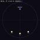
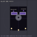
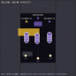
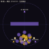
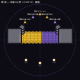
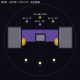
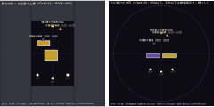
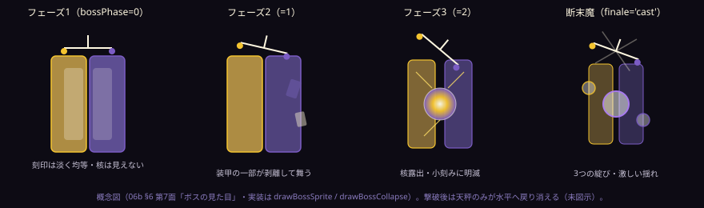

# 06. ステージ（全 7 面・実装値）

定義は `src/data/stages.ts`。味方の配置は `src/data/party.ts`（灯火のミラ (-14,-20)／宵闇のレン (0,-23)／均衡のソウ (14,-20)）が既定で、**面ごとに `Stage.allyPositions` で上書きできる**（#64・`createBattleState` が適用。現状は第1面：ミラ (-7,-14)／レン (0,-16)／ソウ (7,-14)＝狭い場に合わせ中央寄せ、第4面：ミラ (-4.5,-11)／レン (0,-14.5)／ソウ (4.5,-11) の密集包囲）。敵は上方、味方は下方（第4面のみ敵が包囲配置）。
**難易度の枠組み（LVL・数値スケール・解放表）は [06b-difficulty-framework.md](06b-difficulty-framework.md)**。本ファイルは実装されている配置・数値の一覧。
障害物の素材は `solids`（重なった円の和＝連続ブロブ）と `rects`（軸並行の矩形＝四角い壁・#56）で表す。`R=2.4`（円の半径）、`STEP=2.4`（円の間隔）。柱・螺旋は円、壁・ブロックは矩形（角がシャープ）を使う。

**ステージのサイズ（場の広さ）**：手描き仕様のスケッチに対応し、面ごとに「サイズ」を持たせて場の半径 `rField` をスケールで決める（`rFieldForSize(size)=round(25+(size-1)·35/3)`。size1→25, 1.5→31, 2→37, 2.5→43, 3→48, 3.5→54, 4→60）。**第1面=最小25**、**最大＝第7面②=60**（約2.4倍の差）。面が進むほど場が広がるが、戦闘は中央付近で成立させ、広がりは余白・迂回の余地として使う。大アリーナでも弾が対岸へ届くよう、回転方式のサンプリング上限 `rotateXMax` は `max(48, 1.6·fieldR)` と `fieldR` に追従する（`coords.ts`。既定 fieldR=30 では 48 のまま）。盤面は**ズーム/パン**で拡大縮小して見やすくできる（`BattleCanvas`：＋/−ボタン・ホイール・ピンチ／2本指パン。面/フェーズ遷移でリセット）。

共通：`castInitialSpeed=8`（既定。`enemy()` ファクトリの `opts.castInitialSpeed` で個体ごとに明示上書き可能。唯一の例外は第6面の崩し手3体＝`6.5`・#63）。HP は基礎 100 × LVL 倍率（`LVL_SCALE`。明示 `hp` 指定があればそちらが優先）。`castMag` も LVL 依存（[06b](06b-difficulty-framework.md) §2）。各面のフィールド半径は `Stage.rField`（上記サイズ由来）。

## 障害物のヘルパー

| 関数 | 形 |
|---|---|
| `pillar(cx, y0, n, element, kind?)` | 縦の柱（上へ n 個の円・丸い） |
| `block(x0, y0, cols, rows, element, kind?)` | 四角いブロック（cols×rows ぶんを覆う矩形・#56） |
| `wall(x0, x1, y0, rows, element, kind?)` | 横一列の四角い壁（rows 段ぶんの厚みの矩形・#56） |
| `wingWall(x0, x1, y0, rows)` | 翼壁（`unbreakable` 固定の `wall`・#50。壁の帯の端から**場境界（外縁 `|x|≥rField`）まで**側面を塞ぎ、迂回型の外周すり抜けを防ぐ。円形の場では矩形の外側の角が境界円を必ず超えるため、翼壁だけは四隅在場内の制約を免れる） |
| `colonnade(x0, x1, step, y0, n, elems[])` | 列柱（step 間隔で縦 n 段の柱を並べ、elems を順に割当） |
| `spiralArm(cx, cy, n, turns, phase, element, r0=2.5)` | アルキメデス螺旋の腕（半径 `rad = r0 + 0.9·t`。`r0`＝開始半径・#64。第4面は `r0=13` で味方の周りに結界を張る余白を空ける） |

> `block`/`wall` は #56 で円敷き詰めから矩形（`obRect`）へ変更（footprint はほぼ同じ／角がシャープ）。当たり判定・削れ（`carves` で円を引く）・暴発 AoE は円・矩形どちらにも対応（`isSolidAt` / `obstacleOverlapsCircle` / `materialCells`）。

`mechanics`：`obstacles`（障害物有効か）・`enemyFire`（敵が撃つか）の段階的解禁。

---

## ステージ 1 ― 第一の間・門（LVL 1・サイズ1）

- **rField**：`25`（サイズ1＝最小の場）。狭い門の間。`allyPositions` で味方を中央寄せ（(-7,-14)/(0,-16)/(7,-14)）。
- **mechanics**：障害物なし・敵発射なし（命中だけを学ぶ）。
- **障害物**：なし。
  - 

| 敵 | 属性 | LVL | HP | species | 系統 | ロール | 配置 |
|---|---|---|---|---|---|---|---|
| 石像の番人 | dark | 1 | 90 | proto | `line` | attacker | (0, 14) |

---

## ステージ 2 ― 第二の間・通路（LVL 2）

- **rField**：`31`（サイズ1.5。矩形の部屋＋中央リング）。
- **mechanics**：障害物あり・敵発射あり。
- **障害物**：列柱 `colonnade(-18,18, 3.6, 2, 4, [dark,light])`（射線を塞ぐ中央帯）＋中央にもろいリング `ring(0,-6,3.5, neutral, fragile)`（「壊せる」を教える最初の壁・スケッチの中央リング）＋翼壁 `wingWall(18,29,2,4)` / `wingWall(-29,-18,2,4)`（列柱の端から境界 rField=31 まで・#50）。
  - 

| 敵 | 属性 | LVL | HP | species | 系統 | ロール | 配置 |
|---|---|---|---|---|---|---|---|
| 回廊の衛士 | dark | 2 | 110 | wraith | `arc` | attacker（迂回型） | (-11, 20) |
| 影の射手 | dark | 2 | 105 | wraith | `abs` | attacker（迂回型） | (11, 21) |

---

## ステージ 3 ― 第三の間・踊り場（LVL 3）

- **rField**：`37`（サイズ2。正方形の踊り場。戦闘は中央・広がりは余白）。
- **テーマ**：相性（反対極×1.5）と normal 壁。火力型の初登場。
- **障害物**：全幅の光壁 `wall(-18,18,5,2,light)`（2段に厚み増）＋左右の闇の塔 `pillar(±13,-3,5,dark)`＋砕けぬ芯柱 `pillar(±7,9,2,neutral,unbreakable)`（迂回強制）＋もろい囲い `wall(-9,-3,-17,1,neutral,fragile)`＋翼壁 `wingWall(20,35,-14,8)` / `wingWall(-35,-20,-14,8)`（障害物帯の y 範囲を覆い外縁を境界 rField=37 まで・#50）。
  - 

| 敵 | 属性 | LVL | HP | species | 系統 | ロール | 配置 |
|---|---|---|---|---|---|---|---|
| 白の祭司 | light | 3 | 130 | oni | `line`＋`arc` | breaker（火力型） | (-13, 19) |
| 黒の祭司 | dark | 3 | 130 | oni | `line`＋`arc` | breaker（火力型） | (13, 19) |
| 祭壇の影 | dark | 2 | 110 | wraith | `abs` | attacker（迂回型） | (0, 23) |

---

## ステージ 4 ― 第四の間・螺旋（LVL 4・包囲構成／#49）

- **rField**：`48`（サイズ3。外周壁のない開けた円。包囲を成立させる全方位の余地）。
- **テーマ**：守護型（基礎・単色オーラ）の初登場。**暴発デモ（デモ1体）**。**味方は中央寄せ（#64・`Stage.allyPositions`）**：ミラ (-4.5,-11)／レン (0,-14.5)／ソウ (4.5,-11) の密集陣形で、**レンから半径 7 の結界 1 枚で 3 人を囲える**。場が広くなっても密集度は保つ。学習テーマ「円を描いて結界を張り、仲間を守る」を実際に試せる配置。味方重心 ≈ (0,-12) を軸に、敵を正面・左斜め後方・右斜め後方の3方向へ包囲配置。
- **障害物**：前方の全幅壁 `wall(-24,24,6,1,dark)`（番兵との間仕切り）＋味方重心を軸にした光と闇の渦（湾曲バリア）`spiralArm(0,-13,10,1.3,0,light,16)` / `spiralArm(0,-13,10,1.3,π,dark,16)`。渦の開始半径 `r0=16`（#64）で味方から離し、**半径 7 の結界を張っても素材に触れない余白**を確保する（結界は壁に触れると霧散するため、囲える空間が学習テーマの成立条件）。翼壁は**不要**（正面の帯という概念がなく全方位から来るため回り込みが成立しない）。
  - 

| 敵 | 属性 | LVL | HP | species | 系統 | ロール | 配置 | 特記 |
|---|---|---|---|---|---|---|---|---|
| 渦の番兵 | dark | 4 | 140 | golem | `spiral` | guardian（基礎・闇オーラのみ） | (0, 26) 正面 | |
| 坑道の弓手 | light | 3 | 125 | wraith | `abs`＋`arc` | attacker（迂回型） | (-18, -22) 左斜め後方 | |
| 崩し手 | dark | 5 | 165（LVL5倍率） | redWraith | `arc` | **ruptor** | (18, -22) 右斜め後方 | `ruptorTarget='obstacles'`（**最初の1発のみ壁狙い**・解決後は味方狙いへ・05b §5.3）・`fireEvery=2, fireOffset=1`（1・3・5…ターン目＝最低1回は必ず暴発を見せる） |

- 初の敵暴発が解決すると、RUPTOR_DEMO のオーバーレイが一度だけ出る（[04b](04b-misfire-instability.md) §4b.4b）。

---

## ステージ 5 ― 第五の間・深層の広間（LVL 5・鏡像）

- **rField**：`54`（サイズ3.5。深層の広間。戦闘は中央・広がりは余白）。
- **テーマ**：数で攻める。左半分＝光・右半分＝闇の鏡像。**同極すり抜け**の初登場。守護型の**方向づけられた場**を前倒し導入。
- **障害物**：左列柱 `colonnade(-18,0,3.6,-1,4,[light])`／右列柱 `colonnade(3.6,18,3.6,-1,4,[dark])`＋中央の砕けぬ核 `block(-3,1,3,2,neutral,unbreakable)`（スケッチの中央円）＋割れない鏡枠 `pillar(±18,8,3,neutral,unbreakable)`＋翼壁 `wingWall(21,52,-1,4)` / `wingWall(-52,-21,-1,4)`（鏡枠の外側から境界 rField=54 まで・#50）。
  - 

| 敵 | 属性 | LVL | HP | species | 系統 | ロール | 配置 | 特記 |
|---|---|---|---|---|---|---|---|---|
| 鏡像の衛士（光） | light | 4 | 125 | oni | `line`＋`exp` | breaker（火力型） | (-15, 18) | |
| 鏡像の衛士（闇） | dark | 4 | 125 | oni | `line`＋`exp` | breaker（火力型） | (15, 18) | |
| 鏡像の射手（闇） | dark | 5 | 120 | wraith | `abs`＋`poly34` | attacker（迂回型・高難度） | (-7, 23) | `slipThrough`（同極すり抜け）＋sin/cos z場（`sinCosZ(-1)`） |
| 鏡像の射手（光） | light | 5 | 120 | wraith | `abs`＋`poly34` | attacker（迂回型・高難度） | (7, 23) | `slipThrough`＋sin/cos z場（`sinCosZ(1)`） |
| 鏡守のゴーレム | light | 5 | 160 | golem | `spiral` | guardian（中難度） | (0, 26) | `directedAura`（脅威方向へ強度偏重・#47。全周 \|z\|≤zRef） |

---

## ステージ 6 ― 第六の間・封印帯（LVL 6・初回崩壊面・#63 再設計）

- **rField**：`48`（サイズ3。**角丸の封印室（十字ではない）**：中央核＋左右封印壁＋暴発3体が主役）。
- **テーマ**：暴発の**誘発**。崩し手3体（暴発型が主役）＋交互張り・方向づけ併用の守護型（番人＝盾）。**初回崩壊（グリモワール救済）**がこの面で必ず起きる（[04b](04b-misfire-instability.md) §4b.2）。
- **#63 の調整意図**：素の LVL 6 配置だと「全員おまかせ連打」で番人へ集中攻撃し続けても崩し手の暴発 AoE をやり過ごせてしまい、第5面以降のはずの難度上昇が機能していなかった。番人を封印帯の内側から**前衛**へ出し、崩し手3体を封印帯の**手前**（開けた場所）に配置し直すことで、「まず崩し手の暴発を結界で受け止めてから番人を崩す（防御→攻撃の手順）」を要求する構成にした。`balance.test.ts` がこの回帰を固定する（後述）。
- **障害物**：左右2枚に割った `tough` の封印壁 `wall(-24,-13,1,3,neutral,tough)` / `wall(15,24,1,3,neutral,tough)`（中央に回廊を残す。`tough` は術の削りがほぼ通らず、回廊での攻防が主軸になる）＋中央の砕けぬ封印核 `block(-4,1,4,2,neutral,unbreakable)`（正面突破不可・番人の盾。核の左右の回廊を曲線・精密な直線で通す）＋取っ掛かりの光柱 `pillar(±23,-4,2,light)`＋翼壁 `wingWall(25,46,-8,6)` / `wingWall(-46,-25,-8,6)`（横抜けを封じ、境界 rField=48 まで・#50）。
  - 

| 敵 | 属性 | LVL | HP | castInitialSpeed | species | 系統 | ロール | 配置 | 特記 |
|---|---|---|---|---|---|---|---|---|---|
| 封印の番人 | light | 6 | 180 | 8 | golem | `spiral` | guardian（最上位） | **(0, 16)** ＝封印室の内側・前衛（核の奥） | `alternatingAura`（ターンごとに光⇔闇）＋`directedAura`（併用・#47）。崩し手たちの盾として前に立ち、単純な最寄り狙いの連打をまず番人へ吸わせる |
| 崩し手・弧 | light | 6 | 175 | **6.5** | redWraith | `arc` | **ruptor** | (-16, -3)（封印室の手前・開けた場所） | `fireEvery=2, fireOffset=1` |
| 崩し手・折れ | dark | 6 | 175 | **6.5** | redWraith | `abs` | **ruptor** | (16, -3)（同上） | `fireEvery=2, fireOffset=0` |
| 崩し手・捻れ | light | 6 | 175 | **6.5** | redWraith | `poly34` | **ruptor** | (0, -7)（同上） | `fireEvery=2, fireOffset=0` |

- **崩し手3体の配置と数値の意図（#63）**：
  - 封印帯の「前」＝開けた場所に立つため、暴発弾は初手から味方の目前まで届く。遮蔽の不変条件（本ファイル冒頭「障害物ありステージは開始時、全ての味方→敵の直線が壁で遮られる」）から**この3体だけ例外**（`stages.test.ts` に明記）。
  - `castInitialSpeed=6.5`（他の敵は全て既定 `8`。`enemy()` ファクトリの `opts.castInitialSpeed` で明示上書き）。反対極の結界1枚（迎撃減速＋極手前の自然減速）で1本ずつ確実に受け切れる速度に落とし、「正しい色の結界を張れば完封できる波状攻撃」に調整。
  - 属性は光2・闇1（`fireOffset` も0/1に振り、同じ極性の弾が同一ターンに2本重ならないようにする）。おまかせ側が結界を張らずに被弾すると、反対極の弾は「ひるみ」ではなく DoT になるため、ひるみロックで詠唱を止め続ける対処はできない＝弾色を見極めて両極の結界を使い分ける動機づけになる。
  - HP175（旧130から引き上げ）：結界で受けながらであれば時間制限なく倒し切れる。
- 3体は属性・family・位相をずらして撃つ。反対極の結界・パリィで**個別に防げる**（防げば `instability` は積まない）。
- **勝敗の設計（`balance.test.ts`・#63）**：
  - 「全員おまかせ」連打（App の `recommendAll`/`fireAll` と同一挙動：最寄りの敵へ自動照準・防御なし）で連打し続けると、`tough` 封印壁はほぼ削れず前進できないまま、崩し手の暴発 AoE（暴発は常に最大威力＝`sMax(5)×maxFlightSpeed(24)×有利側相性1.5=180`）を結界なしで浴び続け、`instability` の上限到達（致死崩壊）か全滅で必ず敗北する。
  - 対処プレイ（弾色に合わせた反対極の持続結界を予告✕まで覆う半径で張る→崩し手を光弾でひるみロックしながら削る→残った番人は封印核脇の回廊を通過点フィットの曲線で通して撃つ）なら、被弾なく・`instability` をほぼ削らずにクリアできる。

---

## ステージ 7 ― 第七の間・大広間（LVL 7・ボス戦・HPフェーズ制／#45）

- **テーマ**：総力戦。ボスは**多重詠唱**（#44）。HP 66%／33% で**床が崩れ**、①矩形の間から**②開けた大円へ拡大**する（`rField` は 43→60）。撃破後に**断末魔の暴発3連**。スケッチの ①→②→③（②のまま）→④（HP0でボスだけ）に対応。
- **①上層（開始時・矩形の間）・rField=43（サイズ2.5）**：列柱 `colonnade(-22,22,4,-2,5,[light,dark])`＋守護者の盾 `block(-5,-4,4,3,light)`＋翼壁 `wingWall(22,41,-5,7)` / `wingWall(-41,-22,-5,7)`（列柱の y 範囲を覆い外縁を境界 rField=43 まで・#50）。
  - 

| 敵 | 属性 | LVL | HP | hitbox | species | 系統 | ロール | 配置 | 特記 |
|---|---|---|---|---|---|---|---|---|---|
| 魔導書の守護者 | light | 7 | 380 | 3.6 | boss（専用描画） | `abs`＋`line`/`arc`/`exp`/`poly34`（弾ごと） | boss・多重詠唱 | (0, 26) | `castCount=2`・`patternPool=['breaker','attacker']`。breaker 弾は一定場、attacker 弾は `castZField` を保持 |
| 守護者の眷属（迂回） | dark | 6 | 130 | 既定 1.8 | wraith | `abs`＋`poly34` | attacker（高難度） | (-18, 20) | `slipThrough`＋sin/cos z場（`sinCosZ(-1)`） |
| 守護者の眷属（火力） | light | 6 | 130 | 既定 1.8 | oni | `line`＋`arc` | breaker | (18, 20) | |

### HP フェーズ（`Stage.bossPhases`）

| フェーズ | 条件 | castCount | アリーナ | `rField` | 眷属 |
|---|---|---|---|---|---|
| ①上層（開始・矩形の間） | — | 2 | 列柱＋盾＋翼壁 | 43 | 2体 |
| ②中層（大円） | HP ≤ 66% | 2 | `openArena()`＝短い壁 `wall(-16,-4,-3,1,dark)` / `wall(4,16,-3,1,light)` のみ（開けた大円・隠れ場所が少ない） | **60** | 残存 |
| ③下層（大円のまま） | HP ≤ 33% | **3** | **障害物なし** | **60** | **間引き**（`cullMinions: true`＝ボス単独へ・④HP0の断末魔へ繋ぐ） |

- `rField` は `BossPhase.rField` で段階的に**拡大**する（#49・スケッチの ①→②）。②③は同じ大円 60（ボス y=26 は場内）。
- フェーズ移行時：床崩落のログ＋COLLAPSE_PHASE オーバーレイ。持続結界（周回）は崩落で全て霧散する。※「落下中の暗転1ターン」は未実装（テンポ優先・[06b](06b-difficulty-framework.md) §8）。

### 断末魔（暴発3連・撃破の最終演出）

- ボス HP が 0 になっても勝敗は確定せず（`finale='pending'`）、**次のターンにボスが暴発型3連の「最後の一手」を晒して放つ**（`finaleVariant`＝role: ruptor・castCount: 3・`ruptorTarget: 'allies'`。予告＝ゴースト＋赤✕×3）。
- 3本とも**通常ルールの弾**：反対極の結界・パリィで速度0にすれば暴発せず、`instability` も積まない。防げなかった分は通常の暴発（常に最大威力・両極性）＋ `instability +1`（最大+3）。
- このタイミングで `instability` が上限（12）に達すれば、**ボス撃破後でもステージ全体暴発＝ゲームオーバー**（免除なし）。
- 3本を解決したのちに勝敗判定へ進む（`finale='done'` → クリア）。

### ボスの多段外見（`bossView`・#51）

フェーズ（`bossPhase` 0/1/2）・断末魔（`finale`）・撃破確定（`outcome='cleared'`）に応じて `drawBossSprite`/`drawBossCollapse` が段階変化する。詳細は [07-animation.md](07-animation.md) §「ボスの多段外見と最終崩壊」を参照。
  - 
